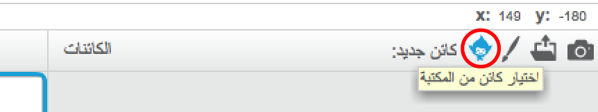
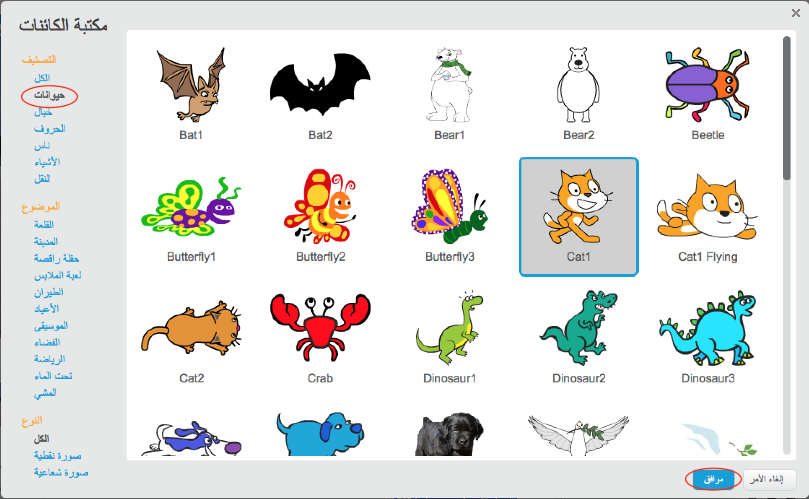

+ انقر فوق __اختيار كائن من المكتبة__ لترى المكتبة التي تحتوي على جميع كائنات Scratch.

	

+ يمكنك تصفح الكائنات حسب الفئة أو النُسق أو النوع. انقر فوق كائن ثم انقر فوق __موافق__ لإضافته إلى مشروعك.

	
