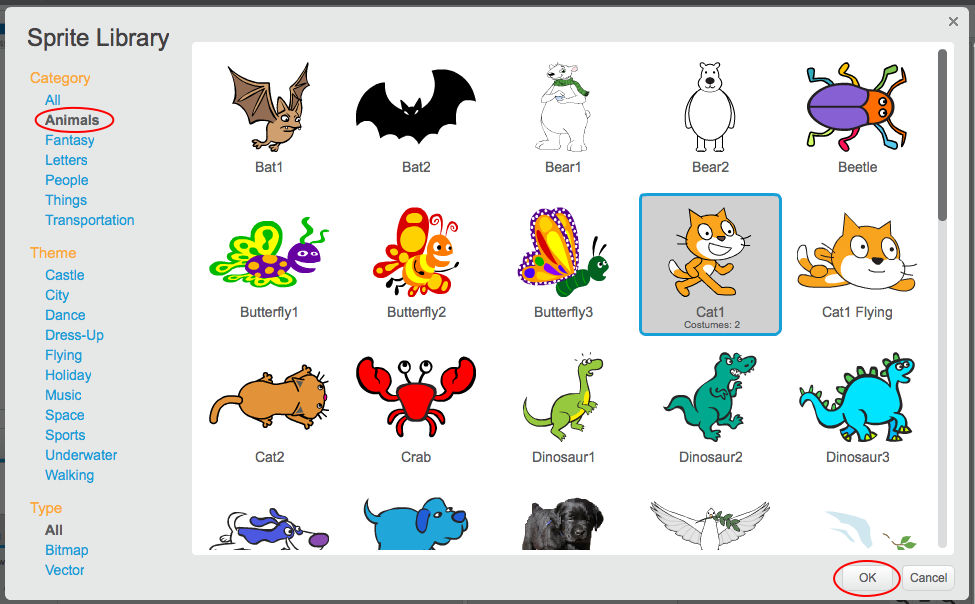

+ Кликнете върху **Изберете слой от библиотеката** да видите библиотеката на всички Scratch sprites.
    
    

+ Можете да преглеждате спрайтове по категория, тема или тип. Кликнете върху шрифт и кликнете върху **ОК** за да го добавите към проекта си.
    
    