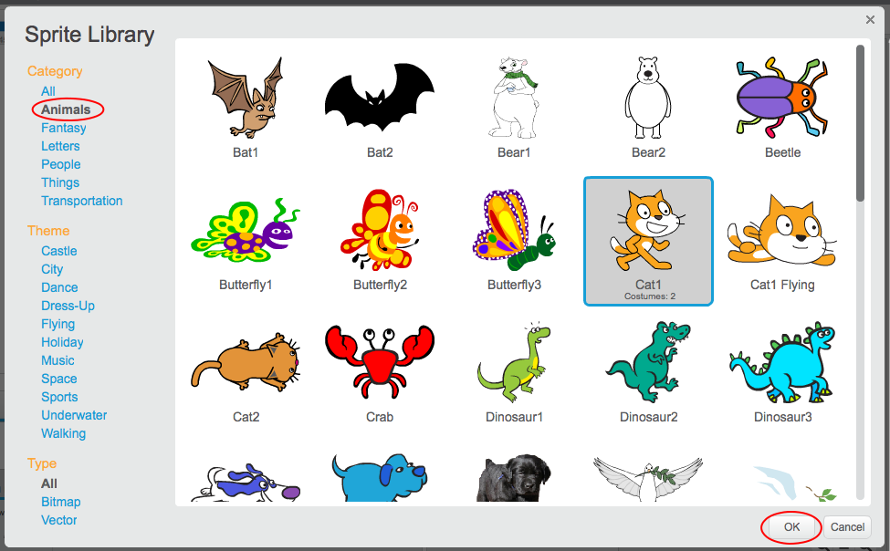

+ লাইব্রেরী থেকে সব স্প্রাইট দেখার জন্য **Choose sprite from library** তে ক্লিক করুন। 
    
    

+ ক্যাটাগরি, থিম, কিংবা টাইপ অনুযায়ী আপনি স্প্রাইট ব্রাউজ করতে পারেন। এজন্য স্প্রাইটের উপর ক্লিক করুন এবং **OK** বাটন ক্লিক করে আপনার প্রজেক্টে নতুন স্প্রাইট যোগ করুন। 
    
    