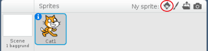
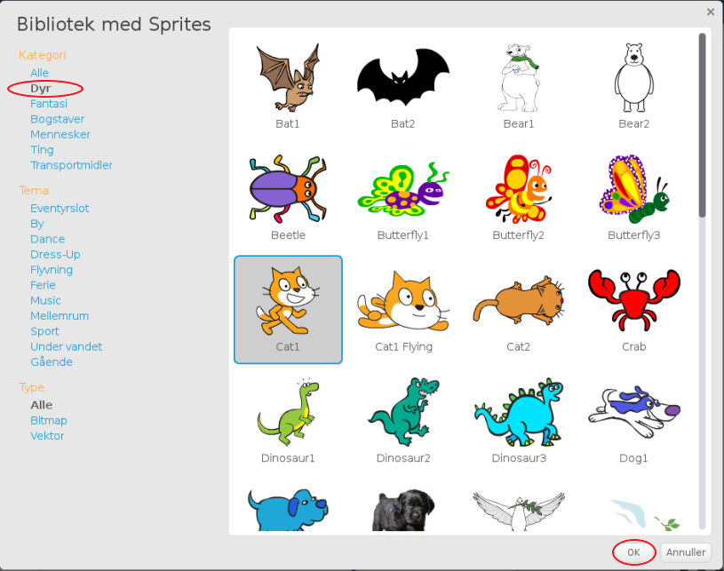

+ Klik på **Vælg sprite fra bibliotek** at se biblioteket af alle Scratch sprites.
    
    

+ Du kan gennemse sprites efter kategori, tema eller type. Klik på et sprite og klik på **OK** at tilføje det til dit projekt.
    
    