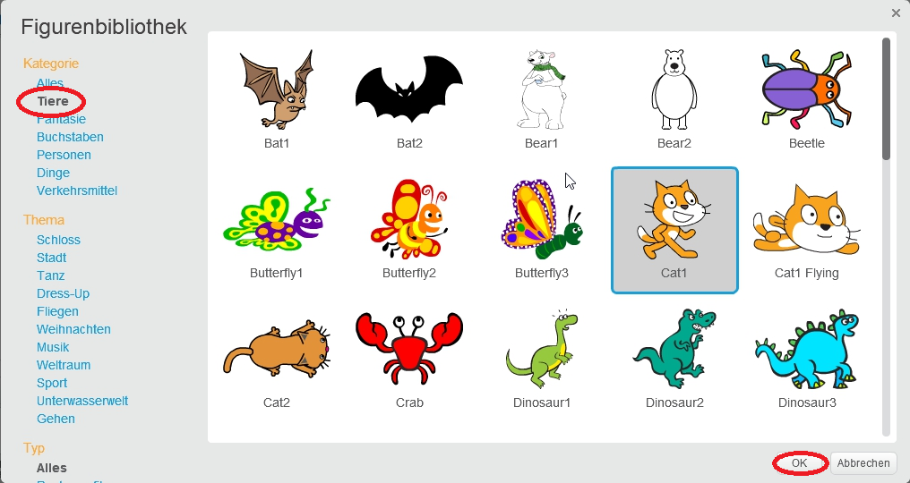

+ Klicke auf **Figur aus der Bibliothek wählen** um die Bibliothek aller Scratch-Figuren zu sehen.
    
    

+ Du kannst die Figuren nach Kategorie, Thema oder Typ durchsuchen. Klicke auf eine Figur und klicke auf **OK** um sie zu deinem Projekt hinzuzufügen.
    
    