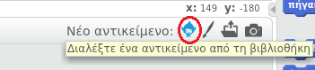
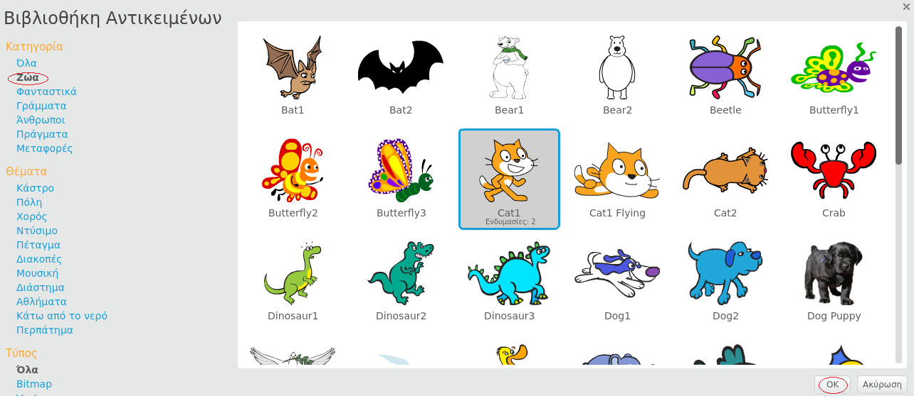

+ Κάνε κλικ στο **Διαλέξτε ένα αντικείμενο από τη βιβλιοθήκη** για να δεις όλα τα αντικείμενα της βιβλιοθήκης του Scratch.
    
    

+ Μπορείς να περιηγηθείς στα αντικείμενα ανά κατηγορία, θέμα ή τύπο. Κάνε κλικ σε ένα αντικείμενο και ξανά κλικ στο **OK** για να το προσθέσεις στο έργο σου.
    
    