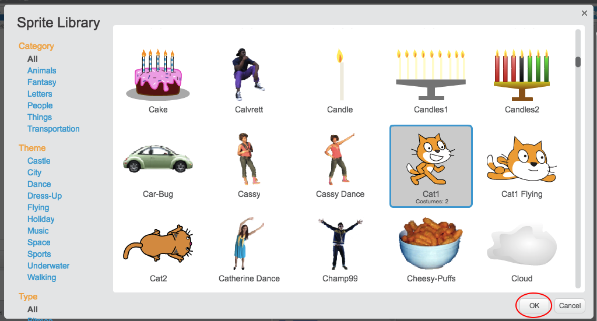

### Adding a new sprite from the Scratch library

+ Click 'Choose sprite from library' to open up a list of all the Scratch sprites.

	

+ You can browse sprites by category, theme or type. Click on a sprite and click ‘OK’ to add it to your project.

	
