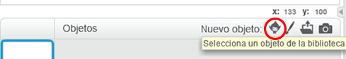
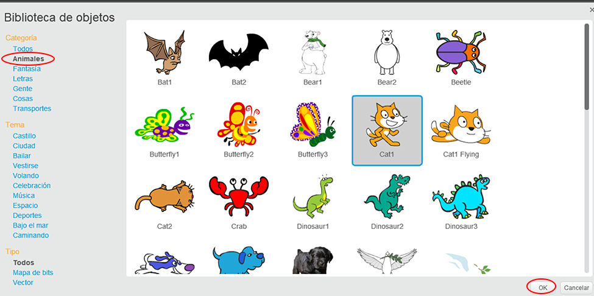

+ Haga clic | 123_8_0_321 | Elija sprite de la biblioteca | 123_9_1_321 | para ver la biblioteca de todos los sprites de Scratch.
    
    

+ Puede explorar sprites por categoría, tema o tipo. Haga clic en un sprite y haga clic en | 123_8_0_321 | Aceptar | 123_9_1_321 | para agregarlo a tu proyecto
    
    