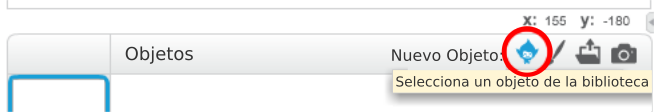
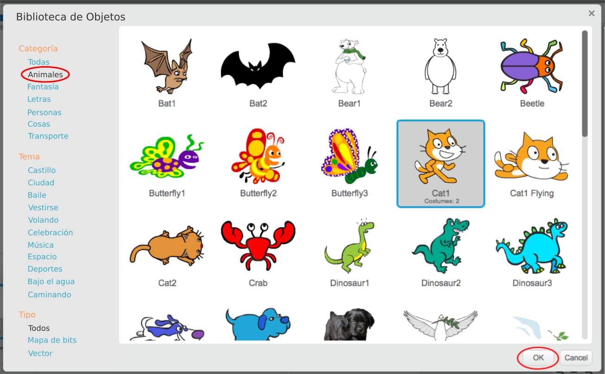

+ Haz clic en **Selecciona un objeto de la biblioteca** para ver la biblioteca de todos los objetos de Scratch.
    
    

+ Puedes explorar los objetos por categoría, tema o tipo. Haz clic en un sprite y luego en **OK** para añadirlo a tu proyecto.
    
    