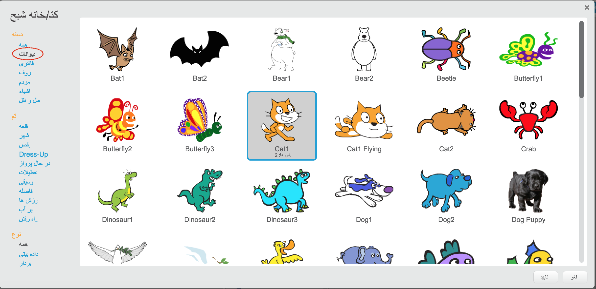

+ روی **کلیک کنید. از کتابخانه** برای پیدا کردن کتابخانه ی همه یاران خراش استفاده کنید.
    
    

+ شما می توانید متن ها را با دسته بندی، موضوع یا نوع فهرست کنید. روی یک راهنما کلیک کنید و روی **OK** کلیک کنید تا آن را به پروژه خود اضافه کنید.
    
    