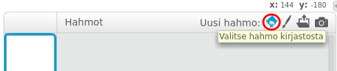

+ Klikkaa **Valitse hahmo kirjastosta** nähdäksesi kaikkien Scratch-hahmojen kirjasto.
    
    

+ Voit selata hahmoja luokan, teeman tai tyypin mukaan. Valitse hahmo ja napsauta **OK** lisätäksesi sen projektiin.
    
    