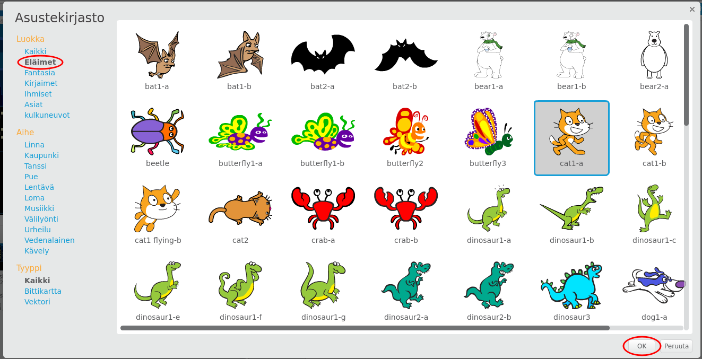

+ Klikkaa **Valitse kirjastosta** sprite nähdäksesi kaikki Scratch-kirjasimet.
    
    

+ Voit selata spritsejä luokan, teeman tai tyypin mukaan. Napsauta sprite ja napsauta **OK** lisätäksesi sen projektiin.
    
    