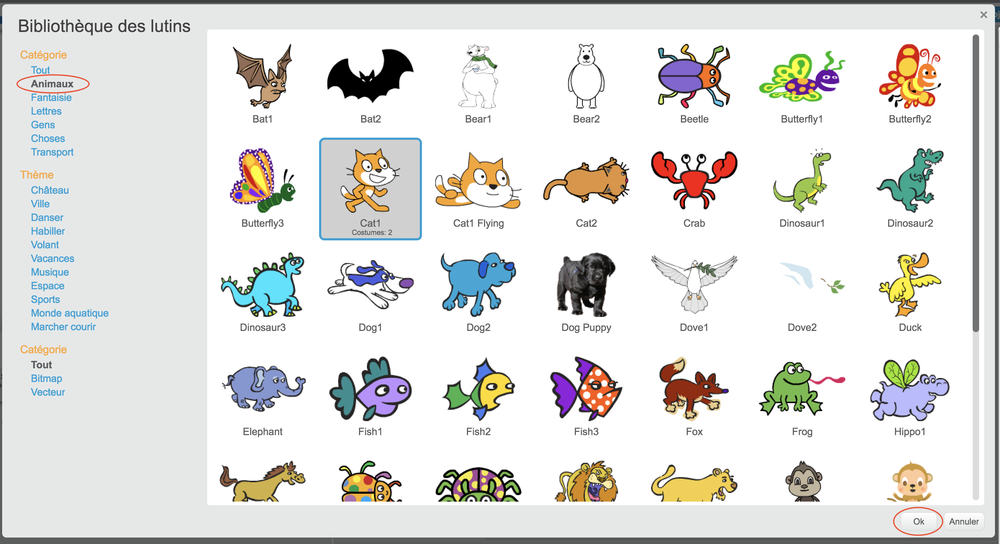

+ Clique sur **Choisir un lutin dans la bibliothèque** pour voir la bibliothèque de tous les lutins de Scratch.
    
    

+ Tu peux parcourir les lutin par catégorie, thème ou type. Clique sur un lutin et clique sur **OK** pour l'ajouter à ton projet.
    
    