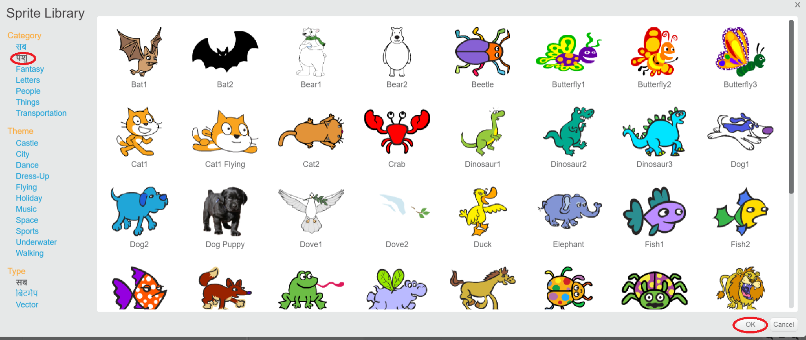

+ सभी स्क्रैच स्प्राइट्स को लाइब्रेरी में देखने के लिए **लाइब्रेरी से स्प्राइट चुनें(Choose sprite from library)** पर क्लिक करें।
    
    

+ आप श्रेणी, विषय, या प्रकार के अनुसार स्प्राइट्स को ब्राउज़ कर सकते हैं। स्प्राइट पर क्लिक करें और इसे अपने प्रोजेक्ट में जोड़ने करने के लिए **ठीक(OK)** पर क्लिक करें।
    
    