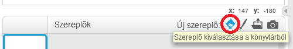
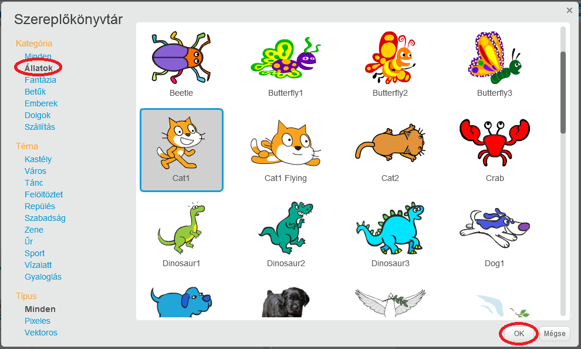

+ Kattintson a **Válassza ki a sprite -et a könyvtárból** hogy megnézze az összes Scratch sprites könyvtárát.
    
    

+ A spriteket kategória, téma vagy típus szerint böngészheti. Kattintson egy sprite-re és kattintson a **OK-ra** a projekthez való hozzáadásához.
    
    