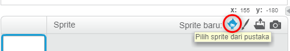
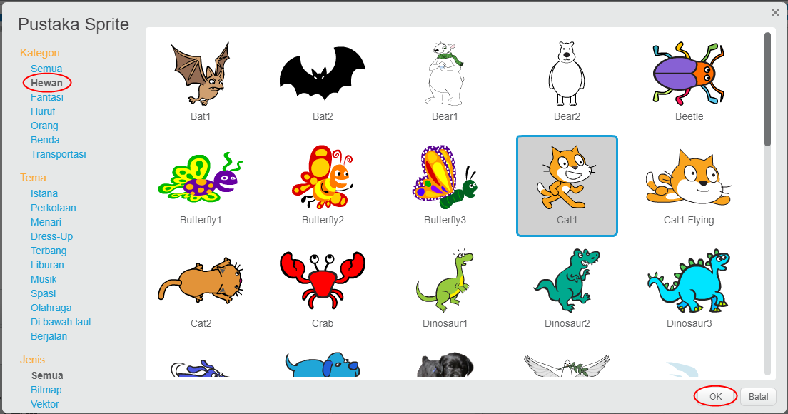

+ Klik **Pilih sprite dari pustaka** untuk melihat pustaka semua sprite pada Scratch.
    
    

+ Anda bisa menjelajah sprite berdasarkan kategori, tema, atau tipe. Klik pada sprite dan klik **OK** untuk menambahkannya ke proyek Anda.
    
    