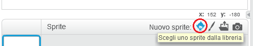
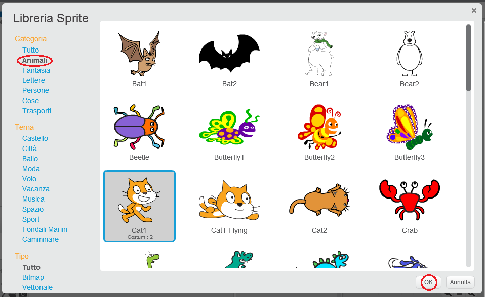

+ Fai clic su **Scegli uno sprite dalla libreria** per visualizzare tutti gli sprite presenti nella libreria di Scratch.
    
    

+ Gli sprite sono organizzati per categoria, tema e tipo. Clicca su uno sprite e poi fai click su **OK** per aggiungerlo al tuo progetto.
    
    