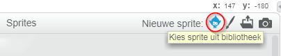
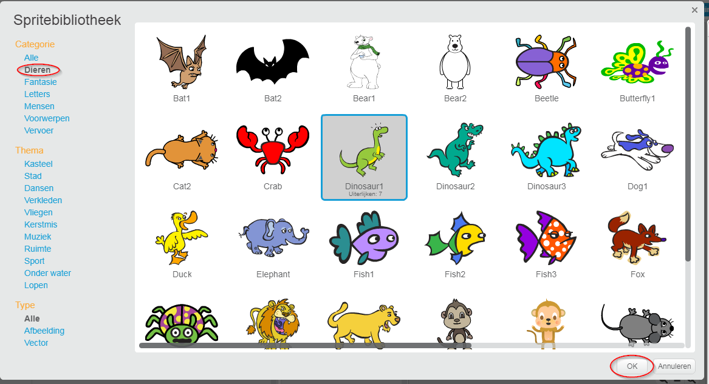

+ Click **Choose sprite from library** to see the library of all Scratch sprites.
    
    

+ You can browse sprites by category, theme, or type. Click on a sprite and click **OK** to add it to your project.
    
    