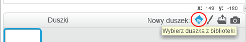
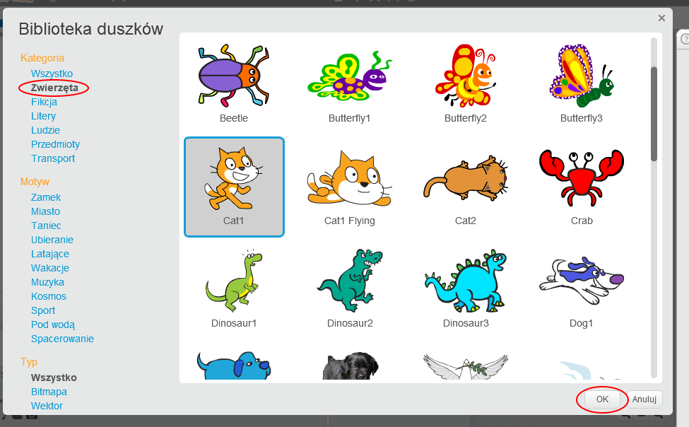

+ Kliknij **Wybierz duszka z biblioteki**, aby wyświetlić bibliotekę wszystkich duszków Scratcha.
    
    

+ Możesz przeglądać duszki według kategorii, motywu lub typu. Kliknij duszka i kliknij **OK**, aby dodać go do swojego projektu.
    
    