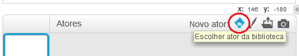
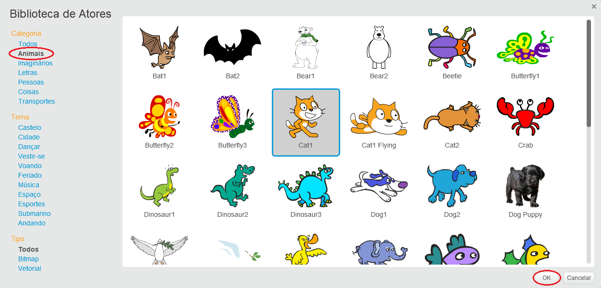

+ Clique em **Escolher sprite da biblioteca** para ver a biblioteca de todas as sprites Scratch.
    
    

+ Você pode procurar sprites por categoria, tema ou tipo. Clique em uma sprite e clique em **OK** para adicioná-la ao seu projeto.
    
    