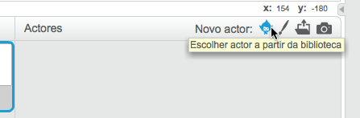
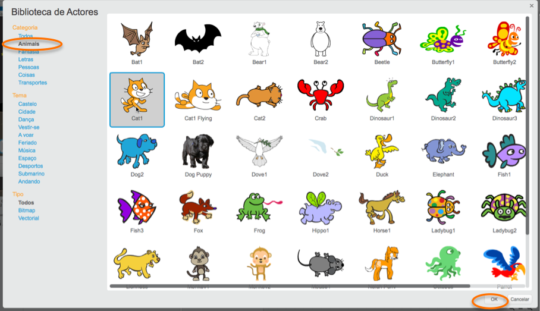

+ Clica em **Escolher actor a partir da biblioteca** para ver a biblioteca de todos os actores do Scratch.
 
    
    
    
    + Podes procurar actores por categoria, tema ou tipo. Clica num actor e clica em **OK** para o adicionar ao teu projeto.
        
        