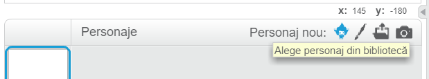
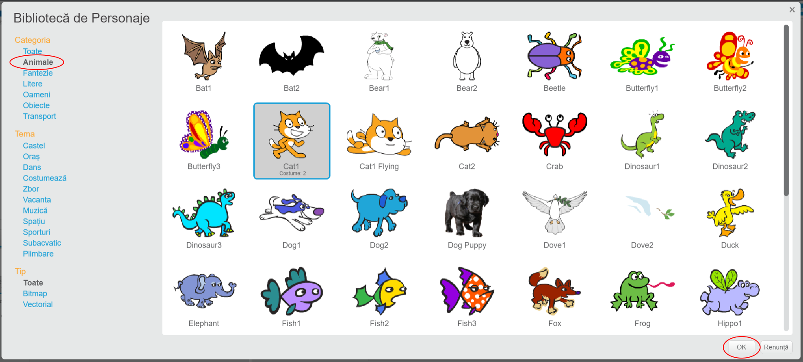

+ Faceți clic pe **Alegeți sprite din biblioteca** pentru a vedea biblioteca tuturor spritelor Scratch.
    
    

+ Puteți căuta sprite după categorie, temă sau tip. Faceți clic pe o sprite și faceți clic pe **OK** pentru ao adăuga la proiectul dvs.
    
    