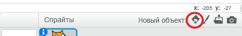
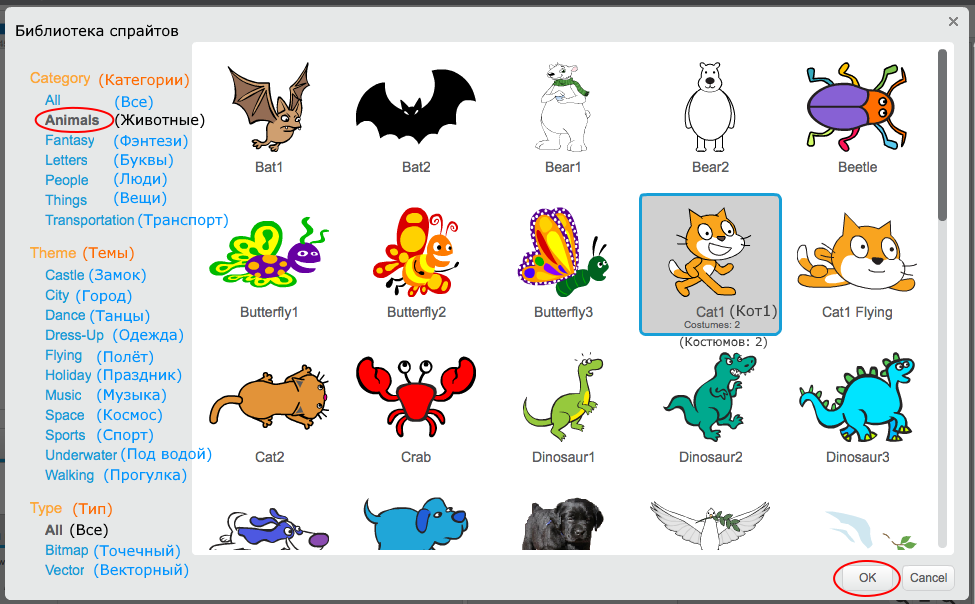

+ Нажмите **Выберите спрайт из библиотеки** чтобы просмотреть библиотеку всех спрайтов Scratch.
    
    

+ Вы можете просматривать спрайты по категориям, темам или типам. Нажмите на спрайт и нажмите **OK** чтобы добавить его в свой проект.
    
    