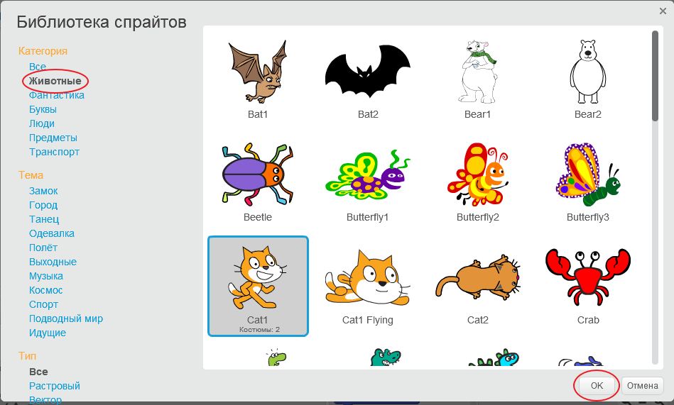

+ Нажми **Choose sprite from library** (Выбрать спрайт из библиотеки), чтобы просмотреть библиотеку всех спрайтов Scratch.
    
    

+ Вы можете просматривать спрайты по категориям, темам или типам. Чтобы добавить спрайт в свой проект, щёлкните на спрайт и нажмите кнопку **OK**.
    
    