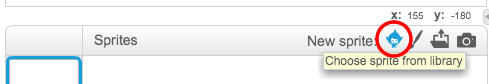

+ Kliknite **Izberite sprite iz knjižnice** in si oglejte knjižnico vseh spratov Scratch.
    
    

+ Poiščete lahko sprite po kategorijah, temah ali tipih. Kliknite na sprite in kliknite **OK** , da ga dodate v svoj projekt.
    
    