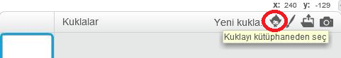
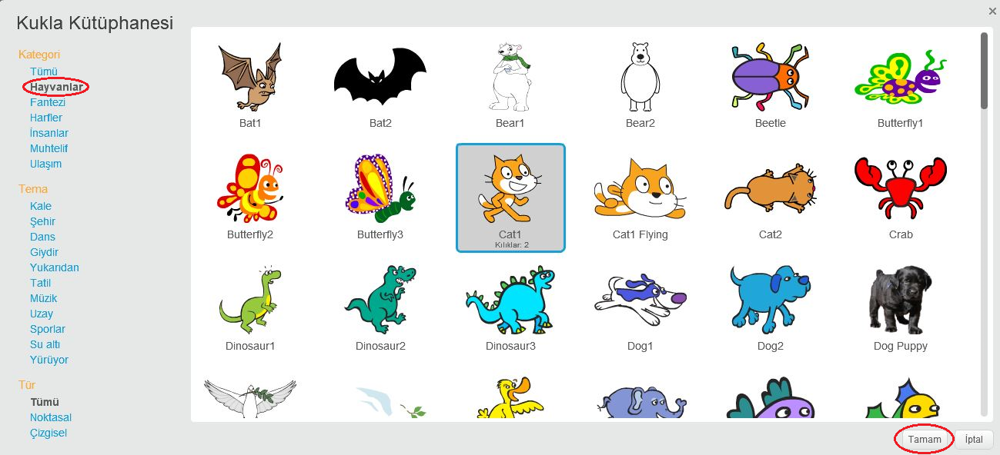

+ Tüm Scratch sprite'larının kütüphanesini görmek için **kütüphanesinden** sprite seçin.
    
    

+ Kuklaları kategorilerine, temalarına veya türlerine göre seçebilirsiniz. Önce bir kukla üzerine ve sonra bu kuklayı projenize eklemek için **Tamam** tuşuna tıklayın.
    
    