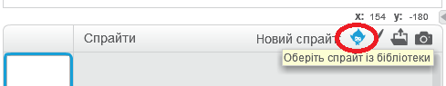
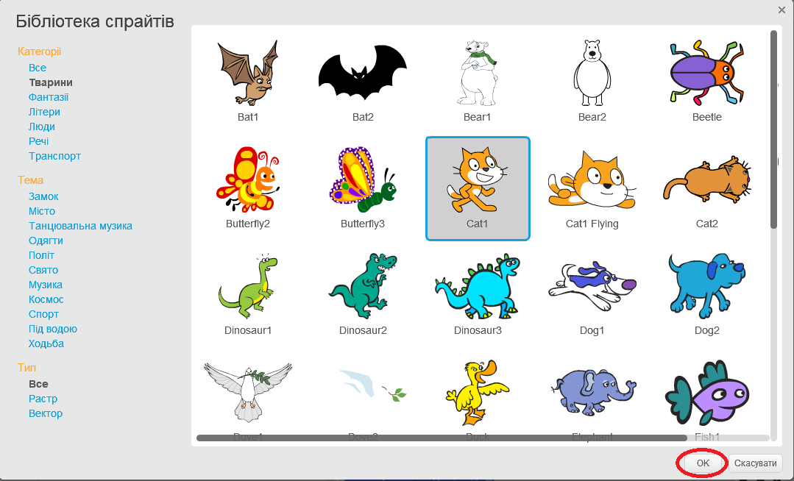

+ Клацніть **Виберіть спрайт з бібліотеки** щоб побачити бібліотеку всіх спрайтів Scratch.
    
    

+ Ви можете переглядати спрайти за категоріями, темами або типами. Натисніть на спрайт та клацніть **OK** щоб додати його до вашого проекту.
    
    